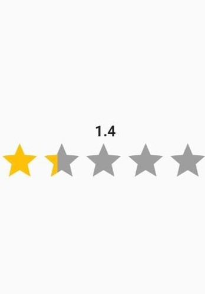
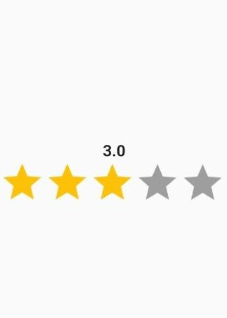

<!--
This README describes the package. If you publish this package to pub.dev,
this README's contents appear on the landing page for your package.

For information about how to write a good package README, see the guide for
[writing package pages](https://dart.dev/guides/libraries/writing-package-pages).

For general information about developing packages, see the Dart guide for
[creating packages](https://dart.dev/guides/libraries/create-library-packages)
and the Flutter guide for
[developing packages and plugins](https://flutter.dev/developing-packages).
-->

[(https://img.shields.io/pub/v/rating_bar_swipe) 
[](https://github.com/sarbagyastha/flutter_rating_bar/blob/master/LICENSE)
[](https://sarbagyastha.com.np/flutter_rating_bar/)
[]
[](https://github.com/sarbagyastha/flutter_rating_bar)
The plugin help you to swip rating bar using double value(like : 0.1 , 0,5, 1)
## Features

 


 
## Getting started

## Usage

#example
```dart
Rating(functionUpdateRating: (value){},
iterativeValue: 1,
initialRating: 0,
isVertical: Axis.horizontal,
itemSize: 5,
);
```

## Additional information

 
